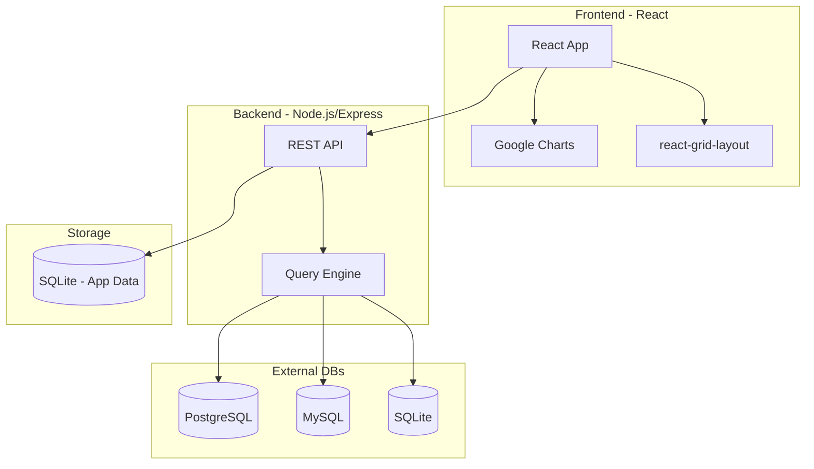
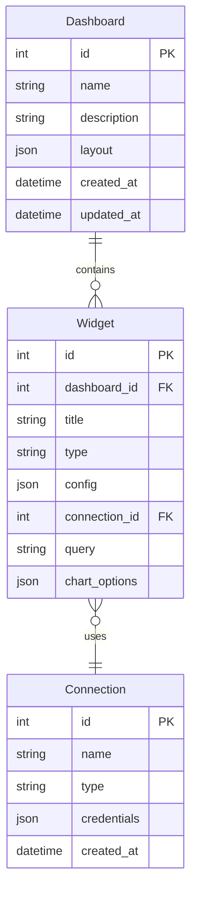

# Dashboard Application Implementation Plan

## Architecture Overview



## Tech Stack

| Layer | Technology |
|-------|------------|
| Frontend | React 18, TypeScript, Vite |
| UI Components | react-grid-layout (drag/drop/resize) |
| Charts | Google Charts (react-google-charts) |
| Styling | Tailwind CSS with dark/light theme |
| Backend | Node.js, Express, TypeScript |
| App Storage | SQLite (better-sqlite3) |
| DB Connectors | pg (PostgreSQL), mysql2 (MySQL), better-sqlite3 (SQLite) |

## Project Structure

```
dash/
├── client/                    # React frontend
│   ├── src/
│   │   ├── components/
│   │   │   ├── Dashboard/
│   │   │   ├── Widget/
│   │   │   ├── Charts/
│   │   │   ├── Connections/
│   │   │   └── Layout/
│   │   ├── hooks/
│   │   ├── context/
│   │   ├── services/
│   │   └── types/
│   └── package.json
├── server/                    # Node.js backend
│   ├── src/
│   │   ├── routes/
│   │   ├── controllers/
│   │   ├── services/
│   │   ├── db/
│   │   └── types/
│   └── package.json
├── .claude/CLAUDE.md          # This plan
└── README.md
```

## Data Models



## API Endpoints

### Dashboards
- `GET /api/dashboards` - List all dashboards
- `GET /api/dashboards/:id` - Get dashboard with widgets
- `POST /api/dashboards` - Create dashboard
- `PUT /api/dashboards/:id` - Update dashboard (name, layout)
- `DELETE /api/dashboards/:id` - Delete dashboard

### Widgets
- `POST /api/widgets` - Create widget
- `PUT /api/widgets/:id` - Update widget
- `DELETE /api/widgets/:id` - Delete widget
- `POST /api/widgets/:id/execute` - Execute widget query

### Connections
- `GET /api/connections` - List connections
- `POST /api/connections` - Create connection
- `PUT /api/connections/:id` - Update connection
- `DELETE /api/connections/:id` - Delete connection
- `POST /api/connections/:id/test` - Test connection

## Key Features Implementation

### 1. Dashboard Grid (react-grid-layout)
- Drag and drop widgets to reorder
- Resize widgets from corners/edges
- Responsive breakpoints
- Layout saved to database on change

### 2. Widget Types
- **Line Chart** - Time series data
- **Bar Chart** - Categorical comparisons
- **Pie Chart** - Part-to-whole relationships
- **Area Chart** - Cumulative trends
- **Table** - Raw data display
- **Stat Card** - Single metric display

### 3. Widget Configuration
Each widget will have an edit modal with:
- Title input
- Chart type selector
- Database connection dropdown
- SQL query editor (with syntax highlighting)
- Chart-specific options (colors, labels, axes)
- Preview button

### 4. Database Connection Manager
- Add/edit/delete connections
- Support PostgreSQL, MySQL, SQLite
- Test connection before saving
- Secure credential storage

### 5. Theme System
- Light/dark mode toggle in header
- CSS variables for theming
- Persist preference in localStorage

## Implementation Phases

### Phase 1: Project Setup and Core Backend
- Initialize React + Vite frontend
- Initialize Express backend
- Set up SQLite database schema
- Create basic API structure

### Phase 2: Dashboard Management
- Dashboard list page
- Create/edit dashboard modal
- Dashboard view page with grid layout

### Phase 3: Widget System
- Widget CRUD operations
- react-grid-layout integration
- Drag/drop and resize functionality

### Phase 4: Charts Integration
- Google Charts setup
- All chart type components
- Chart configuration options

### Phase 5: Database Connections
- Connection management UI
- Query execution engine
- Query editor with syntax highlighting

### Phase 6: Polish and Theme
- Light/dark theme toggle
- Error handling
- Loading states
- Responsive design
